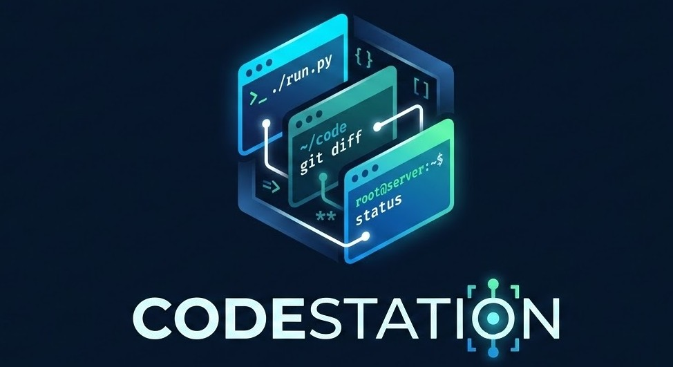

  

---

A macOS terminal multiplexer built with **SwiftUI** and **SwiftTerm**.

## How to download

1. Go to the [Releases](../../releases) page
2. Find the latest release and click on it
3. Under **Assets**, download the `.zip` file
4. Unzip the file and drag **CodeStation.app** to your Applications folder
5. Open CodeStation and enjoy!

## Features

### Environments

Organize your work into separate **environments**, each with its own set of up to **8 terminal sessions** displayed in a grid layout. Switch between environments from the sidebar to keep different projects or workflows isolated.

### Custom Prompt Buttons

Create reusable command buttons that appear on every terminal header. Define a title, pick a color, and set the prompt text — then tap the button to instantly send that command to the terminal. Buttons are saved across sessions and shared across all terminals. Expand or collapse the buttons bar independently on each terminal.

https://github.com/user-attachments/assets/6b0bbe8e-02b4-4cd9-802a-24b416dab889

### Smart Notifications

Stay on top of your AI agents and long-running tasks. CodeStation notifies you when:

- A **command finishes** running — no need to keep watching the terminal
- A terminal is **waiting for input** — know immediately when your AI agent needs assistance

The sidebar badge for each environment turns **red** when a terminal transitions from *cooking* to *ready* or *waiting*, so you can spot activity at a glance even while working in a different environment. The badge clears automatically when you switch to that environment.

Configure notification sounds and toggle individual notification types from Settings.

  <image src="assets/notifications.png" width="500" >

### Drag & Drop

In grid layout (5+ terminals), drag terminals to rearrange them. Drop a terminal onto an empty slot to move it there, or onto another terminal to swap their positions.

https://github.com/user-attachments/assets/48ab2d6c-11be-490b-a160-c6658f9c317d

### Resizable Panels

Drag the dividers between terminals to resize them. **Double-click** any divider to snap all panels back to equal sizes:

- **Vertical dividers** — double-click to equalize column widths
- **Horizontal divider** (grid layout) — double-click to reset the 50/50 row split

### Keyboard Shortcuts

| Shortcut | Action |
|----------|--------|
| ⌘ N | New terminal (new environment if current is full) |
| ⌘ E | New environment |
| ⌘ T | New terminal |
| ⌘ W | Close focused terminal |
| ⌘ 1–8 | Focus terminal by number |
| ⇧⌘ ← / → | Focus previous / next terminal |
| ⇧⌘ ↑ / ↓ | Switch to previous / next environment |
| ⌘ + / − / 0 | Zoom in / out / reset |

## What's coming up?

- **Custom terminal emulators** — Choose your preferred terminal (e.g. iTerm2, Alacritty, Kitty) instead of the built-in one
- **Dragging files to the terminals**

## Buy me a coffee

[Cafecito App](https://cafecito.app/aldo)